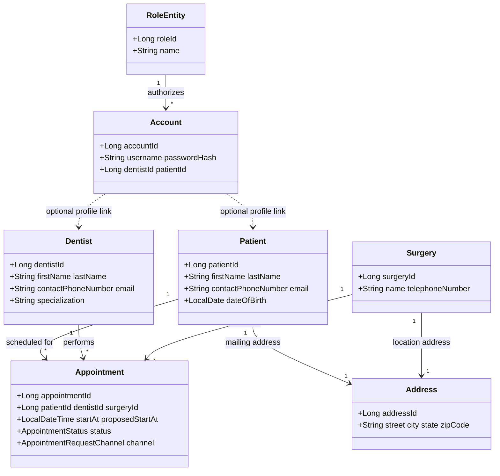
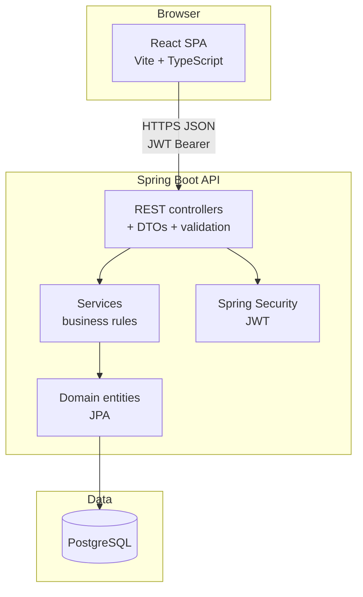
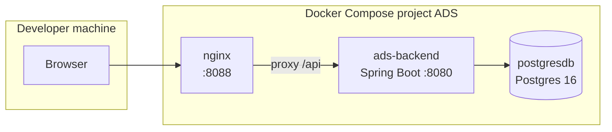
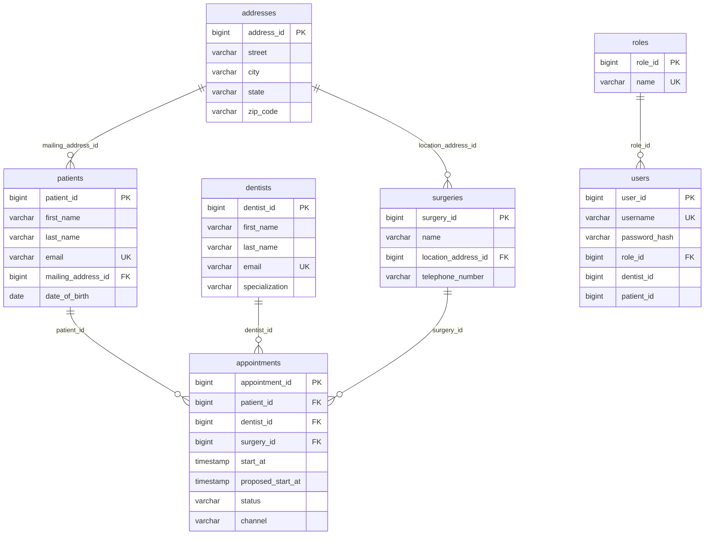

# ADS — Advantis Dental Surgeries

**ADS** is a small enterprise-style web application for managing **dental surgeries, dentists, patients, and appointments**. It includes a secure backend API and a web UI, with deployment options for Docker Compose and Kubernetes.

---

## Tech stack (at a glance)

- **Backend**: Spring Boot (REST), Spring Data JPA (Hibernate), PostgreSQL
- **Security**: JWT (stateless) + role-based authorization (Spring Security)
- **Frontend**: React + TypeScript (Vite)
- **Delivery**: Docker Compose (3-tier), optional Kubernetes (Minikube)
- **CI**: GitHub Actions workflow at `.github/workflows/ads-ci.yml`

---

## Repository layout

- `**ads-backend/`** — Spring Boot REST API (PostgreSQL, JWT security)
- `**ads-frontend/`** — React SPA (Vite + TypeScript)
- `**k8s/**` — Kubernetes manifests (Kustomize) for Minikube

---

## 1) Problem statement

Dental practices need to coordinate **patients**, **dentists**, **surgery locations**, and **appointments** while enforcing scheduling rules and giving each role a clear view of their workflow.

Without a dedicated system, staff rely on spreadsheets or ad hoc communication, which leads to:

- double-booking / overlapping dentist time
- unclear status of requests vs confirmed visits
- patients cannot easily view/request changes online
- weak traceability of approvals/rejections

**Goal:** deliver a small enterprise-style solution with **Spring Boot + PostgreSQL + JWT role security** and a **React** web client supporting registration and appointment workflows.

---

## 2) Scope, stakeholders, requirements

### Scope

- **In scope**: REST API (`/api/v1/`**), relational persistence, JWT authentication, role-based authorization, React SPA, Docker Compose stack, GitHub Actions CI, unit + integration tests.
- **Out of scope**: payment processing, multi-tenant SaaS, native mobile apps, full HL7 integration.

### Stakeholders and roles


| Role               | Typical user       | System access                                                               |
| ------------------ | ------------------ | --------------------------------------------------------------------------- |
| **PATIENT**        | Registered patient | Own appointments; booking; cancel/reschedule requests.                      |
| **DENTIST**        | Provider           | Own schedule; confirm/reject; cancel/approve actions on own visits.         |
| **OFFICE_MANAGER** | Front desk / admin | Directory (patients, dentists, surgeries); all appointments; staff booking. |


### Functional requirements (summary)

- **FR-1** Persist patients, dentists, surgeries, addresses, appointments, user accounts, roles.
- **FR-2** Enforce appointment status transitions and scheduling policies in the service layer.
- **FR-3** Expose REST resources for auth, patient portal, dentist portal, office portal, and health.
- **FR-4** Web UI for login and role-specific portals.
- **FR-5** Seed demo users for grading and demos.

### Non-functional requirements

- **NFR-1 Security**: passwords hashed; JWT for API; role-based authorization.
- **NFR-2 Reliability**: health endpoint; Compose health checks for startup ordering.
- **NFR-3 Maintainability**: layered packages; DTOs for API boundaries.
- **NFR-4 Quality**: automated tests on every push (CI).

### Primary use cases (table)

Actors: **Patient**, **Dentist**, **Office manager**, **System** (email notifications, validation).


| ID    | Use case                          | Primary actor                    | Summary                                                                  |
| ----- | --------------------------------- | -------------------------------- | ------------------------------------------------------------------------ |
| UC-01 | Register surgery                  | Office manager                   | Create a surgery site with name, address, phone.                         |
| UC-02 | Register dentist                  | Office manager                   | Add dentist profile (name, contact, specialization).                     |
| UC-03 | Enroll patient                    | Office manager                   | Add patient with demographics and mailing address.                       |
| UC-04 | Sign in                           | All                              | Authenticate; receive JWT for subsequent API calls.                      |
| UC-05 | View own appointments             | Patient, Dentist                 | List appointments relevant to the signed-in user.                        |
| UC-06 | Request appointment               | Patient                          | Choose dentist, surgery, slot; create REQUESTED visit.                   |
| UC-07 | Book confirmed visit              | Office manager                   | Choose patient, dentist, surgery, slot; create BOOKED visit immediately. |
| UC-08 | View month schedule               | Patient, Dentist                 | Calendar view of busy times (privacy differs by role).                   |
| UC-09 | View all appointments (directory) | Office manager                   | List all appointments; act on rows.                                      |
| UC-10 | Confirm / reject request          | Dentist, Office manager          | Move REQUESTED to BOOKED or reject.                                      |
| UC-11 | Cancel visit / approve cancel     | Dentist, Office manager          | Cancel flow and patient cancel approval.                                 |
| UC-12 | Reschedule flow                   | Patient, Dentist, Office manager | Propose new time; approve or reject.                                     |
| UC-14 | Health check                      | Operations                       | `GET /api/v1/health` for readiness in Docker.                            |


Extensions (cross-cutting): Bean Validation on DTOs, structured errors, CORS configuration.

---

## 3) Analysis — Domain model (UML class diagram)




Enumerations in code (`AppointmentStatus`, `AppointmentRequestChannel`, `Role`) drive valid status transitions and portal behavior.

---

## 4) Architecture

### Logical view (layers)




### Physical view (Docker Compose)




---

## 5) Database design (ER diagram)




Notes:

- `Account` entity maps to table `users`.
- `Appointment` stores FK ids as scalar columns (no heavy entity graph).

---

## Quick start (recommended): run everything in Docker

**Requirements:** Docker + Docker Compose v2.

From the **repository root** (the folder that contains `ADS/`):

```bash
docker compose -f ADS/docker-compose.yml up --build
```

Or from **inside `ADS/`**:

```bash
cd ADS
docker compose up --build
```

### URLs (default)

- **Web UI**: [http://localhost:8088/](http://localhost:8088/)
- **REST API (host)**: [http://localhost:8080/](http://localhost:8080/) (example: `GET /api/v1/health`)
- **Postgres (host)**: `localhost:5432`

### Notes (why this works reliably)

- nginx serves the React build and **proxies `/api/`** to the backend, so the browser is **same-origin** (no extra CORS pain in the typical demo setup).
- Inside Compose, containers reach each other via **service name + container port** (e.g., `postgresdb:5432`, `ads-backend:8080`), not `localhost`.
- The UI container waits for the backend health check to avoid “startup 502” proxy errors.

### Common Docker commands

Run in background:

```bash
docker compose -f ADS/docker-compose.yml up --build -d
```

Stop containers (keep DB volume):

```bash
docker compose -f ADS/docker-compose.yml down
```

Stop and delete DB volume:

```bash
docker compose -f ADS/docker-compose.yml down -v
```

More detail: see `DOCKER.md`.

---

## Demo script (presentation-ready)

1. **Start the stack** (Docker Compose quick start above).
2. **Open the Web UI** at [http://localhost:8088/](http://localhost:8088/)
3. **Login using seeded accounts** (below) and show role-specific behavior:
  - **Office Manager**: create/register surgeries/dentists/patients.
  - **Patient**: book/view appointments.
  - **Dentist**: view schedule and manage appointment lifecycle (confirm/reject/cancel/reschedule).
4. **Prove the API is running**:
  - `GET http://localhost:8080/api/v1/health`
5. **(Optional) Show security**:
  - Login endpoint issues JWT; protected endpoints require `Authorization: Bearer <token>`.
6. **(Optional) Show tests/CI**:
  - Mention GitHub Actions workflow `.github/workflows/ads-ci.yml`.

---

## Default login users (seeded)


| Role           | Username   | Password   |
| -------------- | ---------- | ---------- |
| Office Manager | `manager`  | `password` |
| Dentist        | `dentist1` | `password` |
| Patient        | `patient1` | `password` |


---

## Local development (without Docker for the app)

Use this for faster iteration (hot reload).

### Database

Run PostgreSQL so it is reachable at `**localhost:5432`** (credentials in `ads-backend/src/main/resources/application.yml`).

### Backend

```bash
cd ADS/ads-backend
mvn spring-boot:run
```

API base URL: **[http://localhost:8080](http://localhost:8080)**

### Frontend

```bash
cd ADS/ads-frontend
npm install
npm run dev
```

Open **[http://localhost:5173/](http://localhost:5173/)** (Vite proxies `/api` to the backend; see `vite.config.ts`).

---

## Kubernetes (Minikube)

Manifests live under `ADS/k8s/` (Kustomize).

```bash
kubectl apply -k ADS/k8s
```

Full steps (building/loading images, port-forward vs NodePort, CORS, teardown) are in `ADS/k8s/README.md`.

### Kubernetes operations (start / stop / status)

Start (deploy everything):

```bash
kubectl apply -k ADS/k8s
```

Check if the app is running:

```bash
# Pods (should be Running/Ready)
kubectl get pods -n ads

# Services (look for ads-ui / ads-backend)
kubectl get svc -n ads

# Rollout status (wait until ready)
kubectl rollout status -n ads deploy/ads-backend
kubectl rollout status -n ads deploy/ads-ui
```

View logs:

```bash
kubectl logs -n ads deploy/ads-backend --tail=200
kubectl logs -n ads deploy/ads-ui --tail=200
```

Port-forward to access locally (recommended for demos):

```bash
# UI
kubectl port-forward -n ads service/ads-ui 8088:80

# API
kubectl port-forward -n ads service/ads-backend 8080:8080
```

Stop (delete everything deployed by kustomize):

```bash
kubectl delete -k ADS/k8s
```

---

## Testing & CI/CD

- Backend tests:

```bash
cd ADS/ads-backend
mvn test
```

- CI workflow: `.github/workflows/ads-ci.yml`
  - runs backend tests + frontend build on pushes/PRs

