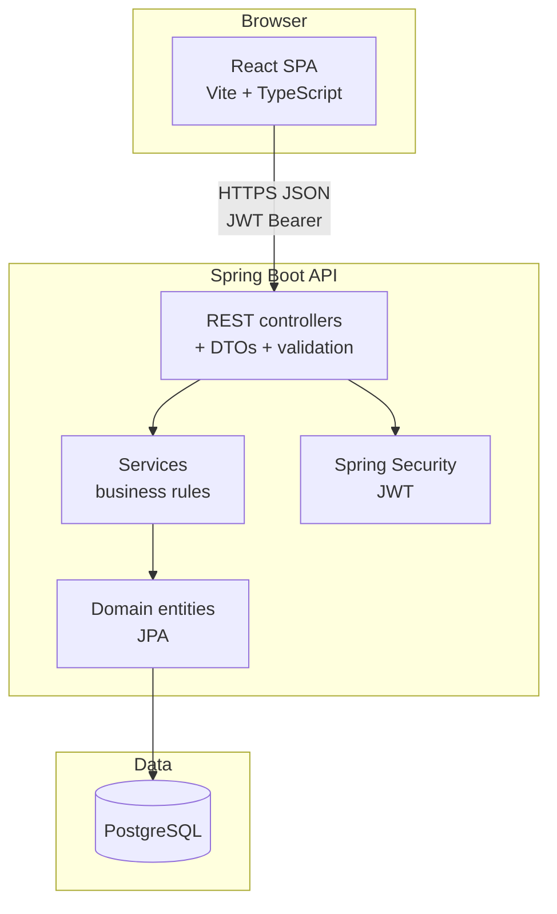
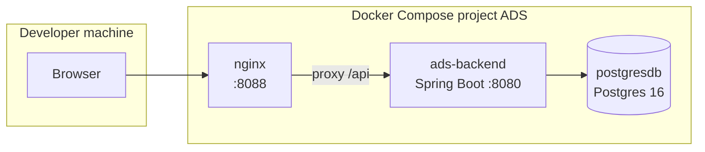

# Architecture — high-level solution

## 1. Logical view (layers)

## 2. Physical view (Docker Compose)

- **Production-style dev**: nginx serves static `dist/` and proxies `/api/` so the browser is same-origin with the API path prefix.
- **Local dev without Docker**: Vite dev server proxies `/api` to `localhost:8080`.

## 3. API surface

- **REST** base path: `/api/v1/**` (auth, patient, dentist, office, health).

## 4. Key technology choices

| Concern | Choice |
|---------|--------|
| Runtime | Java 21, Spring Boot 3 |
| API | REST + Jackson JSON; Java `record` DTOs |
| Security | JWT, stateless filters, `@EnableMethodSecurity` |
| Persistence | Spring Data JPA, Hibernate, Flyway/Liquibase not used — schema from JPA `ddl-auto` in dev |
| Front end | React 18, TypeScript, fetch to `/api/v1` |
| Build | Maven (backend), npm (frontend) |
| Automation | GitHub Actions (see repo `.github/workflows/ads-ci.yml`) |
