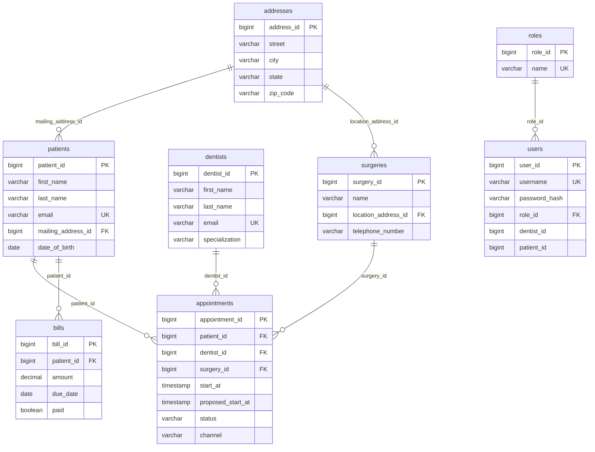

# Database design — ER diagram (logical)

Physical tables follow JPA `@Table` names. Relationships below match **foreign key columns** on child tables (some are plain `Long` columns without JPA `@ManyToOne` on `Appointment` / `Bill` for simplicity in this codebase).

## Notes

- **Account** entity maps to table **`users`** (legacy naming in JPA).
- **Appointment** stores `patient_id`, `dentist_id`, `surgery_id` as scalars (no JPA association graph on the entity).
- **Address** is shared pattern for patient mailing and surgery location.
