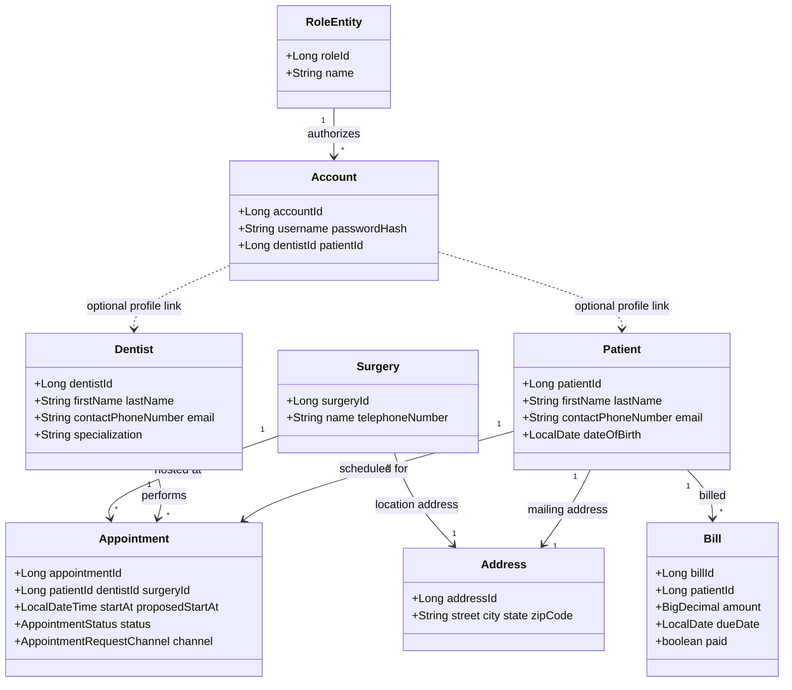

# Analysis / design — domain model (conceptual class diagram)

The **implementation** lives in Java under `ads-backend/src/main/java/edu/miu/cs/cs489appsd/ads/domain/`. The diagram below is a **conceptual** view aligned with those entities (attributes abbreviated).

**Enumerations** (see `AppointmentStatus`, `AppointmentRequestChannel`, `Role` in code): drive valid status transitions and API behavior.
